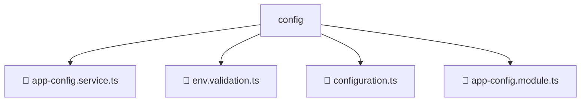

# 📂 CONFIG

> 💎 **Mavluda Beauty - Luxury Professional Architecture**

### 📍 Breadcrumb Navigation
`. > backend > src > common > config`

## 🎯 PURPOSE
This directory encapsulates `Backend Core/Infrastructure` level functionality within the Mavluda Beauty ecosystem, ensuring proper separation of concerns and architectural transparency.

**FSD / Architecture Layer:** `Backend Core/Infrastructure`

## 🏗️ ARCHITECTURE


## 📄 FILE REGISTRY

| Item Name | Type | Responsibility | Key Aliases Used |
|-----------|------|----------------|------------------|
| `📄 app-config.service.ts` | `.ts` | Service logic | `@nestjs/config, @nestjs/common` |
| `📄 env.validation.ts` | `.ts` | General functionality | `None` |
| `📄 configuration.ts` | `.ts` | General functionality | `None` |
| `📄 app-config.module.ts` | `.ts` | Module configuration | `@nestjs/config, @nestjs/common` |

## 🔗 DEPENDENCIES
- `@nestjs/common`
- `@nestjs/config`

## 🛠️ USAGE
```typescript
// Example usage context
import { ... } from './app-config.service';

// Integrate app-config.service logic into your feature.
```
