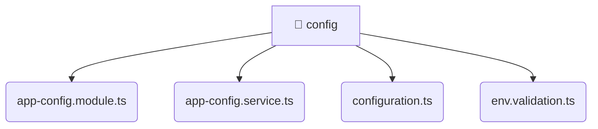

# [root](/) / [backend](/backend) / [src](/backend/src) / [common](/backend/src/common) / [config](/backend/src/common/config)

## 🏷️ 📁 Config

### 🎯 PURPOSE
The `config` directory provides core backend services and configuration.

### 🏗️ ARCHITECTURE


### 📄 FILE REGISTRY
| File Name | Type | Responsibility | Key Aliases Used |
|---|---|---|---|
| `app-config.module.ts` | `ts` | Module configuration and provider registration. | @nestjs |
| `app-config.service.ts` | `ts` | Business logic and service layer. | @nestjs |
| `configuration.ts` | `ts` | Core logic implementation. | None |
| `env.validation.ts` | `ts` | Core logic implementation. | None |

### 🔗 DEPENDENCIES
- `./app-config.service`
- `./configuration`
- `./env.validation`
- `@nestjs/common`
- `@nestjs/config`
- `class-transformer`
- `class-validator`

### 🛠️ USAGE
```typescript
// Seamlessly integrate config into your refined workflows:
import { /* exported members */ } from '@path/to/config';
```
