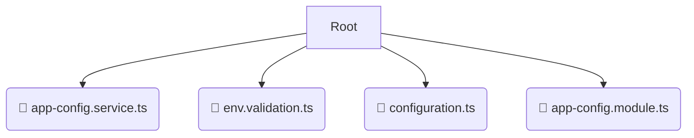

# ⚙️ config

*Breadcrumbs:* [backend](/backend) / [src](/backend/src) / [common](/backend/src/common) / [config](/backend/src/common/config)

## 🎯 PURPOSE
This directory `config` is an integral part of the Mavluda Beauty ecosystem. It supports the scalable NestJS backend architecture.
This directory is meticulously maintained to uphold the 'Luxury Professional' standards of the Mavluda Beauty brand.

## 🏗️ ARCHITECTURE


## 📄 FILE REGISTRY
| File Name | Type | Responsibility | Key Aliases Used |
|---|---|---|---|
| `app-config.service.ts` | `ts` | Core functionality | `@nestjs/common, @nestjs/config` |
| `env.validation.ts` | `ts` | Core functionality | `None` |
| `configuration.ts` | `ts` | Core functionality | `None` |
| `app-config.module.ts` | `ts` | Module configuration | `@nestjs/common, @nestjs/config` |

## 🔗 DEPENDENCIES
- `@nestjs/common`
- `@nestjs/config`

## 🛠️ USAGE
```typescript
// Example placeholder for interacting with the config module
import { example } from './app-config.service.ts';
```
