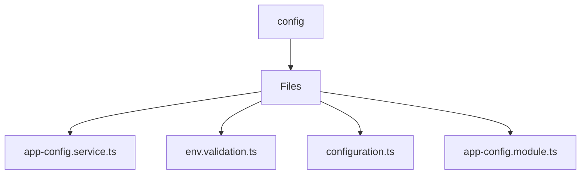

# 🏷️ Config Directory

> *Elegance, Precision, and Luxury Professionalism — The Mavluda Beauty Standard.*

## 🧭 Breadcrumb Navigation
[backend](/backend) ➔ [src](/backend/src) ➔ [common](/backend/src/common) ➔ [config](/backend/src/common/config)

## 🎯 Purpose
This directory encapsulates the essential architecture and logic for the **Config** domain within the Mavluda Beauty ecosystem. It serves as a foundational component ensuring robust, scalable, and elegant operations.

## 🏗️ Architecture


## 📄 File Registry
| File Name | Type | Responsibility | Key Aliases Used |
|---|---|---|---|
| `app-config.service.ts` | TypeScript | Exports: AppConfigService | None |
| `env.validation.ts` | TypeScript | Exports: validate | None |
| `configuration.ts` | TypeScript | Defines logic and structure for configuration.ts. | None |
| `app-config.module.ts` | TypeScript | Exports: AppConfigModule | None |

## 🔗 Dependencies
- `@nestjs/common`
- `@nestjs/config`
- `class-transformer`
- `class-validator`

## 🛠️ Usage
```typescript
// To utilize the luxurious capabilities of this module:
import { AppConfigService } from './path/to/appconfigservice';

// Ensure properly typed interactions per Mavluda Beauty standards
```
