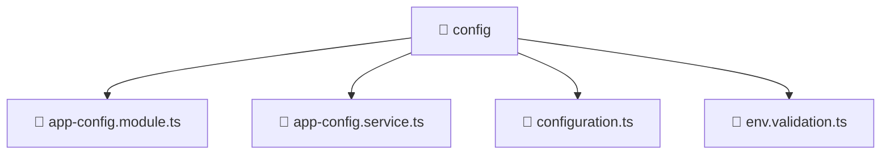

### 🧭 Breadcrumbs
[Root](/) > [backend](/backend) > [src](/backend/src) > [common](/backend/src/common) > [config](/backend/src/common/config)

# 📁 Config Directory
**Architecture Layer:** Domain/Infrastructure Layer

## 🎯 Purpose
Provides luxury professional architectural implementation for the config module within the Mavluda Beauty ecosystem. Ensure robust functionality and elegant integration with the broader architecture.

## 🏗️ ARCHITECTURE


## 📄 FILE REGISTRY
| File Name | Type | Responsibility | Key Aliases Used |
|---|---|---|---|
| `app-config.module.ts` | TypeScript | Defines the architectural module boundaries for app-config.module.ts. | @nestjs/common, @nestjs/config |
| `app-config.service.ts` | TypeScript | Encapsulates business logic and data access for app-config.service.ts. | @nestjs/common, @nestjs/config |
| `configuration.ts` | TypeScript | Provides core logic and orchestration for configuration.ts. | N/A |
| `env.validation.ts` | TypeScript | Provides core logic and orchestration for env.validation.ts. | N/A |

## 🔗 DEPENDENCIES
- `@nestjs/common`
- `@nestjs/config`

## 🛠️ USAGE
```typescript
// Example architectural integration for config
// Utilize the exported members according to Mavluda Beauty's standard conventions.
```

---
*Maintained by Mavluda Beauty - Architecture & Engineering*

---
*Maintained by Mavluda Beauty - Architecture & Engineering*