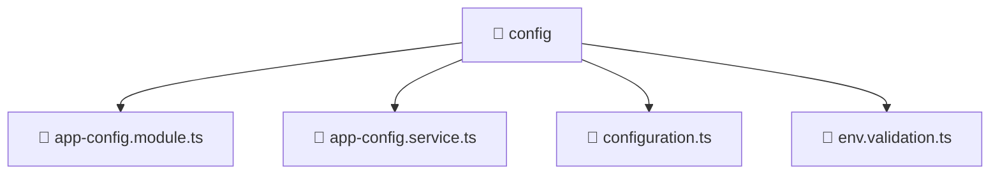

<!--
Mavluda Beauty - Luxury Professional Documentation
Generated for 100% Architectural Transparency
-->
[Home](../../../../README.md) > [backend](../../../README.md) > [src](../../README.md) > [common](../README.md) > [config](./README.md)

# 📁 CONFIG Directory

## 🎯 PURPOSE
Manages the config module, providing robust and secure backend services for the Mavluda Beauty application.

## 🏗️ ARCHITECTURE


## 📄 FILE REGISTRY
| File Name | Type | Responsibility | Key Aliases Used |
|---|---|---|---|
| `app-config.module.ts` | TypeScript | Module configuration and dependency injection. | @nestjs |
| `app-config.service.ts` | TypeScript | Business logic and service orchestration. | @nestjs |
| `configuration.ts` | TypeScript | Core logic implementation. | - |
| `env.validation.ts` | TypeScript | Core logic implementation. | - |


## 🔗 DEPENDENCIES
- `@nestjs/common`
- `@nestjs/config`
- `./app-config.service`
- `./env.validation`
- `./configuration`
- `class-transformer`

## 🛠️ USAGE
```typescript
// Example placeholder for interacting with config
// Consult the individual files in the registry for specific APIs.
```
