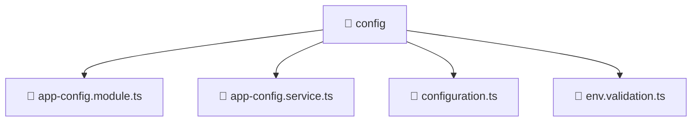

# 📁 config

[Root](/../../../../README.md) / [backend](../../../README.md) / [src](../../README.md) / [common](../README.md) / [config](./README.md)

## 🎯 Purpose
Delivering luxury-tier architectural components and high-performance logic for the **config** domain. This directory is a crucial part of the Mavluda Beauty full-stack ecosystem, ensuring seamless scalability, robust performance, and an elite digital experience.

## 🏗️ Architecture


## 📄 File Registry
| File Name | Type | Responsibility | Key Aliases Used |
|---|---|---|---|
| `app-config.module.ts` | Module | Defines the architectural module boundaries for app-config.module.ts. | @nestjs |
| `app-config.service.ts` | Service | Encapsulates business logic and data access for app-config.service.ts. | @nestjs |
| `configuration.ts` | TypeScript | Provides core logic and orchestration for configuration.ts. | N/A |
| `env.validation.ts` | TypeScript | Provides core logic and orchestration for env.validation.ts. | N/A |


## 🔗 Dependencies
**Internal / Aliases:**
- `./app-config.service`
- `./configuration`
- `./env.validation`
- `@nestjs/common`
- `@nestjs/config`

**External:**
- `class-transformer`


## 🛠️ Usage
```typescript
// Example usage within the Mavluda Beauty ecosystem
import { relevantMember } from './app-config.module';

// Integrate into the application architecture
relevantMember.execute();
```
