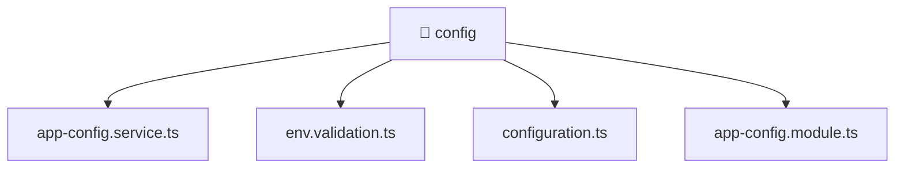

[🏠 Home](../../../../README.md) > [backend](../../../README.md) > [src](../../README.md) > [common](../README.md) > [config](./README.md)

# 📁 config

### 🎯 PURPOSE
Welcome to the exquisite **config** module of the Mavluda Beauty ecosystem. This directory focuses on orchestrating Business Services. It is designed adhering to our 'Luxury Professional' standards.

### 🏗️ ARCHITECTURE


### 📄 FILE REGISTRY
| File Name | Type | Responsibility | Key Aliases Used |
|---|---|---|---|
| `app-config.module.ts` | Angular Module | Configures an application module or layer Defines classes: AppConfigModule. | @nestjs |
| `app-config.service.ts` | Angular Service | Provides injectable business logic or services Defines classes: AppConfigService. | @nestjs |
| `configuration.ts` | TypeScript File | Provides logic and definitions for configuration.ts. | None |
| `env.validation.ts` | TypeScript File | Defines classes: EnvironmentVariables. | None |

### 🔗 DEPENDENCIES
- `@nestjs/common`
- `@nestjs/config`
- `class-transformer`

### 🛠️ USAGE
```typescript
// Example interaction or integration snippet
// Import members from config based on module boundaries
```
