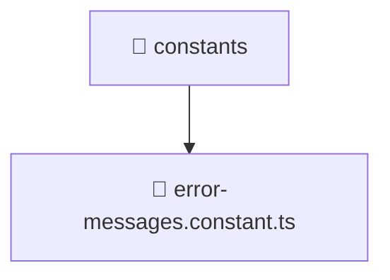

# 📁 constants

[Root](/.) > [backend](/backend) > [src](/backend/src) > [common](/backend/src/common) > [constants](/backend/src/common/constants)

## 🎯 Purpose
Delivering luxury-tier architectural components and high-performance logic for the **constants** domain. This directory is a crucial part of the Mavluda Beauty full-stack ecosystem, ensuring seamless scalability, robust performance, and an elite digital experience.

## 🏗️ Architecture


## 📄 File Registry
| File Name | Type | Responsibility | Key Aliases Used |
|---|---|---|---|
| `error-messages.constant.ts` | TypeScript | Handles logic and definitions for error-messages.constant.ts | None |

## 🔗 Dependencies
*(No specific external or cross-module dependencies detected)*

## 🛠️ Usage
```typescript
// Example usage within the Mavluda Beauty ecosystem
import { relevantMember } from './constants';

// Integrate into the application architecture
relevantMember.execute();
```
