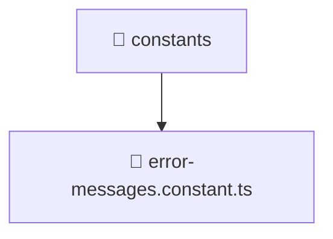

### 🧭 Breadcrumbs
[Root](/) > [backend](/backend) > [src](/backend/src) > [common](/backend/src/common) > [constants](/backend/src/common/constants)

# 📁 Constants Directory
**Architecture Layer:** Domain/Infrastructure Layer

## 🎯 Purpose
Provides luxury professional architectural implementation for the constants module within the Mavluda Beauty ecosystem. Ensure robust functionality and elegant integration with the broader architecture.

## 🏗️ ARCHITECTURE


## 📄 FILE REGISTRY
| File Name | Type | Responsibility | Key Aliases Used |
|---|---|---|---|
| `error-messages.constant.ts` | TypeScript | Provides core logic and orchestration for error-messages.constant.ts. | N/A |

## 🔗 DEPENDENCIES
*No internal path alias dependencies explicitly resolved in this directory.*

## 🛠️ USAGE
```typescript
// Example architectural integration for constants
// Utilize the exported members according to Mavluda Beauty's standard conventions.
```

---
*Maintained by Mavluda Beauty - Architecture & Engineering*

---
*Maintained by Mavluda Beauty - Architecture & Engineering*