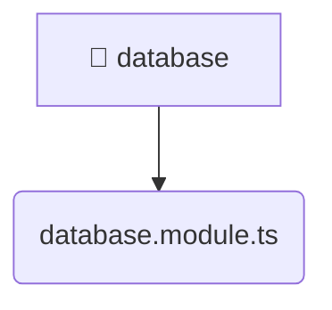

# [backend](/backend) / [src](/backend/src) / [common](/backend/src/common) / [database](/backend/src/common/database)

## 🏷️ 💾 Database

### 🎯 PURPOSE
The `database` directory forms a critical foundation within the Mavluda Beauty ecosystem, meticulously orchestrating the database logic to ensure a seamless and premium experience. Rooted in the NestJS backend architecture, it delivers robust, high-performance operations tailored for high-end beauty and wedding services.

### 🏗️ ARCHITECTURE


### 📄 FILE REGISTRY
| File Name | Type | Responsibility | Key Aliases Used |
|---|---|---|---|
| `database.module.ts` | `ts` | Encapsulates premium logic and definitions for `database.module.ts`. | @nestjs/config, @nestjs/common, @nestjs/mongoose |


### 🔗 DEPENDENCIES
- `@nestjs/common`
- `@nestjs/config`
- `@nestjs/mongoose`

### 🛠️ USAGE
```typescript
// Seamlessly integrate database into your refined workflows:
import { /* exported members */ } from '@path/to/database';
```
