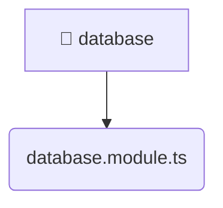

# [root](/) / [backend](/backend) / [src](/backend/src) / [common](/backend/src/common) / [database](/backend/src/common/database)

## 🏷️ 📁 Database

### 🎯 PURPOSE
The `database` directory provides core backend services and configuration.

### 🏗️ ARCHITECTURE


### 📄 FILE REGISTRY
| File Name | Type | Responsibility | Key Aliases Used |
|---|---|---|---|
| `database.module.ts` | `ts` | Module configuration and provider registration. | @nestjs |

### 🔗 DEPENDENCIES
- `@nestjs/common`
- `@nestjs/config`
- `@nestjs/mongoose`

### 🛠️ USAGE
```typescript
// Seamlessly integrate database into your refined workflows:
import { /* exported members */ } from '@path/to/database';
```
