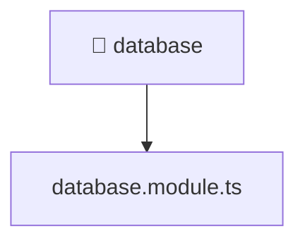

[🏠 Home](../../../../README.md) > [backend](../../../README.md) > [src](../../README.md) > [common](../README.md) > [database](./README.md)

# 📁 database

### 🎯 PURPOSE
Welcome to the exquisite **database** module of the Mavluda Beauty ecosystem. This directory handles specific domain assets and logic. It is designed adhering to our 'Luxury Professional' standards.

### 🏗️ ARCHITECTURE


### 📄 FILE REGISTRY
| File Name | Type | Responsibility | Key Aliases Used |
|---|---|---|---|
| `database.module.ts` | Angular Module | Configures an application module or layer Defines classes: DatabaseModule. | @nestjs |

### 🔗 DEPENDENCIES
- `@nestjs/common`
- `@nestjs/config`
- `@nestjs/mongoose`

### 🛠️ USAGE
```typescript
// Example interaction or integration snippet
// Import members from database based on module boundaries
```
