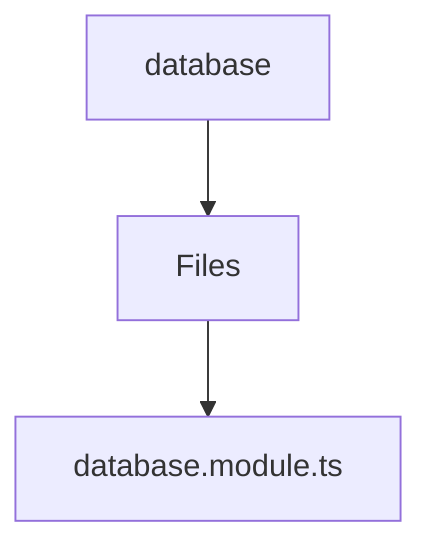

# 🏷️ Database Directory

> *Elegance, Precision, and Luxury Professionalism — The Mavluda Beauty Standard.*

## 🧭 Breadcrumb Navigation
[backend](/backend) ➔ [src](/backend/src) ➔ [common](/backend/src/common) ➔ [database](/backend/src/common/database)

## 🎯 Purpose
This directory encapsulates the essential architecture and logic for the **Database** domain within the Mavluda Beauty ecosystem. It serves as a foundational component ensuring robust, scalable, and elegant operations.

## 🏗️ Architecture


## 📄 File Registry
| File Name | Type | Responsibility | Key Aliases Used |
|---|---|---|---|
| `database.module.ts` | TypeScript | Exports: DatabaseModule | None |

## 🔗 Dependencies
- `@nestjs/common`
- `@nestjs/config`
- `@nestjs/mongoose`

## 🛠️ Usage
```typescript
// To utilize the luxurious capabilities of this module:
import { DatabaseModule } from './path/to/databasemodule';

// Ensure properly typed interactions per Mavluda Beauty standards
```
