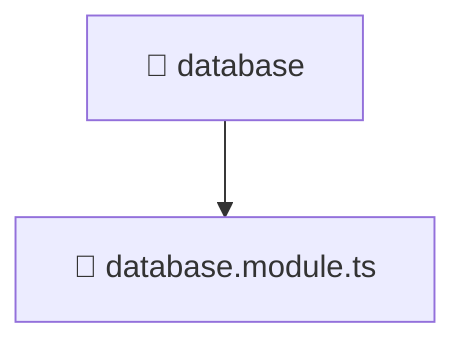

# 📁 Database

[Root](../../../../) > [backend](../../../) > [src](../../) > [common](../) > [database](./)

## 🎯 Purpose
Delivering luxury-tier architectural components and high-performance logic for the **Database** domain. This directory is a crucial part of the Mavluda Beauty full-stack ecosystem, ensuring seamless scalability, robust performance, and an elite digital experience.

**Architecture Layer:** Backend Infrastructure (Feature Sliced Design / Layered Architecture)

## 🏗️ Architecture


## 📄 File Registry
| File Name | Type | Responsibility | Key Aliases Used |
|---|---|---|---|
| `database.module.ts` | TypeScript | Core logic and utilities for this domain. | @nestjs/config, @nestjs/common, @nestjs/mongoose |


## 🔗 Dependencies
- `@nestjs/common`
- `@nestjs/config`
- `@nestjs/mongoose`

## 🛠️ Usage
```markdown
> This directory acts primarily as a structural container or logic module.
> To interact with its contents, import the relevant exported members from the `index.ts` or specifically targeted files.
```
