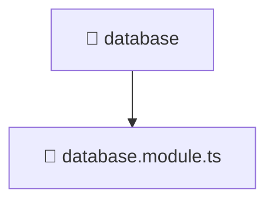

# 📁 database

[Root](/.) > [backend](/backend) > [src](/backend/src) > [common](/backend/src/common) > [database](/backend/src/common/database)

## 🎯 Purpose
Shared utility functions, helpers, and common logic applicable across multiple modules.

## 🏗️ Architecture


## 📄 File Registry
| File Name | Type | Responsibility | Key Aliases Used |
|---|---|---|---|
| `database.module.ts` | TypeScript | Defines the architectural module boundaries for database.module.ts. | @nestjs |

## 🔗 Dependencies
- `@nestjs/common`
- `@nestjs/config`
- `@nestjs/mongoose`

## 🛠️ Usage
```typescript
import { specificUtility } from './utils';
const result = specificUtility(input);
```
