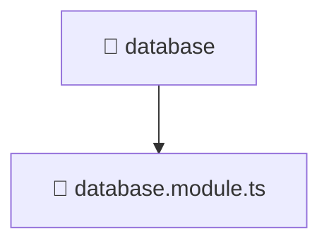

# 📁 database

[Root](/../../../../README.md) / [backend](../../../README.md) / [src](../../README.md) / [common](../README.md) / [database](./README.md)

## 🎯 Purpose
Delivering luxury-tier architectural components and high-performance logic for the **database** domain. This directory is a crucial part of the Mavluda Beauty full-stack ecosystem, ensuring seamless scalability, robust performance, and an elite digital experience.

## 🏗️ Architecture


## 📄 File Registry
| File Name | Type | Responsibility | Key Aliases Used |
|---|---|---|---|
| `database.module.ts` | Module | Defines the architectural module boundaries for database.module.ts. | @nestjs |


## 🔗 Dependencies
**Internal / Aliases:**
- `@nestjs/common`
- `@nestjs/config`
- `@nestjs/mongoose`


## 🛠️ Usage
```typescript
// Example usage within the Mavluda Beauty ecosystem
import { relevantMember } from './database.module';

// Integrate into the application architecture
relevantMember.execute();
```
