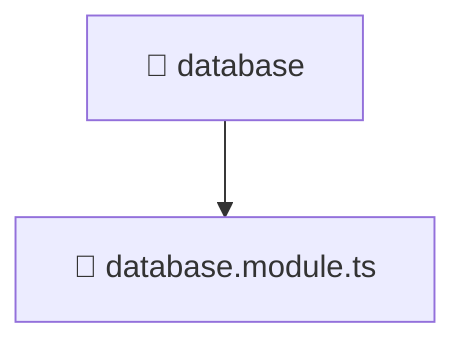

### 🧭 Breadcrumbs
[Root](/) > [backend](/backend) > [src](/backend/src) > [common](/backend/src/common) > [database](/backend/src/common/database)

# 📁 Database Directory
**Architecture Layer:** Domain/Infrastructure Layer

## 🎯 Purpose
Provides luxury professional architectural implementation for the database module within the Mavluda Beauty ecosystem. Ensure robust functionality and elegant integration with the broader architecture.

## 🏗️ ARCHITECTURE


## 📄 FILE REGISTRY
| File Name | Type | Responsibility | Key Aliases Used |
|---|---|---|---|
| `database.module.ts` | TypeScript | Defines the architectural module boundaries for database.module.ts. | @nestjs/common, @nestjs/config, @nestjs/mongoose |

## 🔗 DEPENDENCIES
- `@nestjs/common`
- `@nestjs/config`
- `@nestjs/mongoose`

## 🛠️ USAGE
```typescript
// Example architectural integration for database
// Utilize the exported members according to Mavluda Beauty's standard conventions.
```

---
*Maintained by Mavluda Beauty - Architecture & Engineering*

---
*Maintained by Mavluda Beauty - Architecture & Engineering*