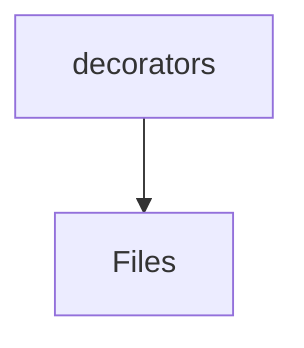
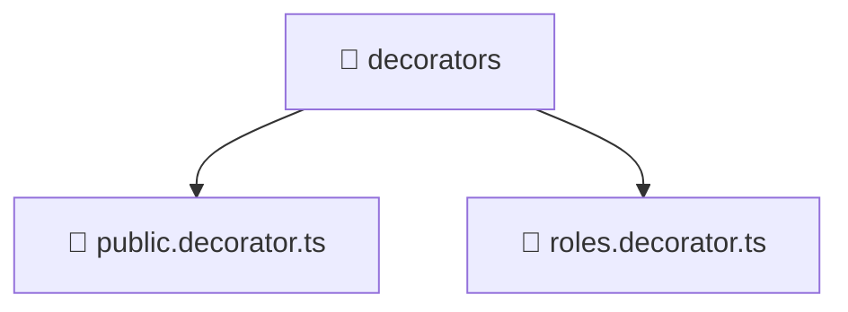

# ✨ Decorators Directory

[backend](/backend) > [src](/backend/src) > [common](/backend/src/common) > [decorators](/backend/src/common/decorators)

## 🎯 Purpose
A high-level module handling `decorators` logic within the Mavluda Beauty ecosystem. This directory adheres to our "Luxury Professional" architectural standards.


## 🏗️ Architecture



## 📄 File Registry
| File Name | Type | Responsibility | Key Aliases Used |
|-----------|------|----------------|------------------|
| `public.decorator.ts` | TypeScript | Provides localized typescript definitions. | @nestjs/common |
| `roles.decorator.ts` | TypeScript | Provides localized typescript definitions. | @nestjs/common |

## 🔗 Dependencies
- `@nestjs/common`

## 🛠️ Usage
```typescript
// Architectural overview snippet
import { InternalLogic } from './internal-file';
// Ensure adherence to Hexagonal / FSD principles
```

## 📝 Existing Context
# 📁 decorators

[Root](/.) > [backend](/backend) > [src](/backend/src) > [common](/backend/src/common) > [decorators](/backend/src/common/decorators)

## 🎯 Purpose
Delivering luxury-tier architectural components and high-performance logic for the **decorators** domain. This directory is a crucial part of the Mavluda Beauty full-stack ecosystem, ensuring seamless scalability, robust performance, and an elite digital experience.

## 🏗️ Architecture


## 📄 File Registry
| File Name | Type | Responsibility | Key Aliases Used |
|---|---|---|---|
| `public.decorator.ts` | TypeScript | Provides core logic and orchestration for public.decorator.ts. | @nestjs |
| `roles.decorator.ts` | TypeScript | Provides core logic and orchestration for roles.decorator.ts. | @nestjs |

## 🔗 Dependencies
- `@nestjs/common`

## 🛠️ Usage
```typescript
// Example usage within the Mavluda Beauty ecosystem
import { relevantMember } from './decorators';

// Integrate into the application architecture
relevantMember.execute();
```
