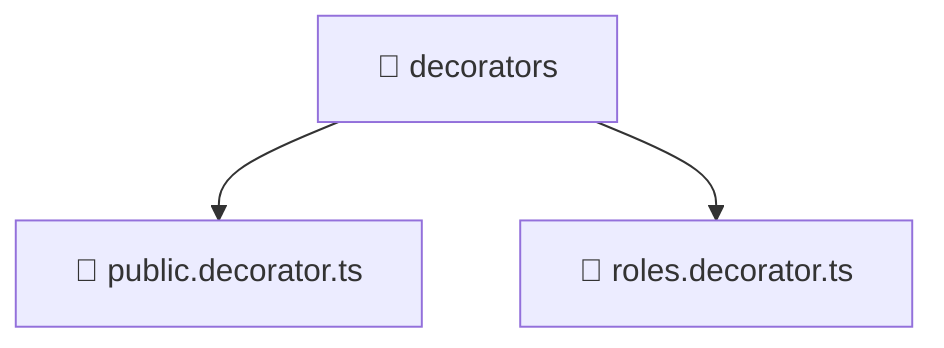

# 📁 decorators

[Root](/../../../../README.md) / [backend](../../../README.md) / [src](../../README.md) / [common](../README.md) / [decorators](./README.md)

## 🎯 Purpose
Delivering luxury-tier architectural components and high-performance logic for the **decorators** domain. This directory is a crucial part of the Mavluda Beauty full-stack ecosystem, ensuring seamless scalability, robust performance, and an elite digital experience.

## 🏗️ Architecture


## 📄 File Registry
| File Name | Type | Responsibility | Key Aliases Used |
|---|---|---|---|
| `public.decorator.ts` | TypeScript | Provides core logic and orchestration for public.decorator.ts. | @nestjs |
| `roles.decorator.ts` | TypeScript | Provides core logic and orchestration for roles.decorator.ts. | @nestjs |


## 🔗 Dependencies
**Internal / Aliases:**
- `@nestjs/common`


## 🛠️ Usage
```typescript
// Example usage within the Mavluda Beauty ecosystem
import { relevantMember } from './public.decorator';

// Integrate into the application architecture
relevantMember.execute();
```
