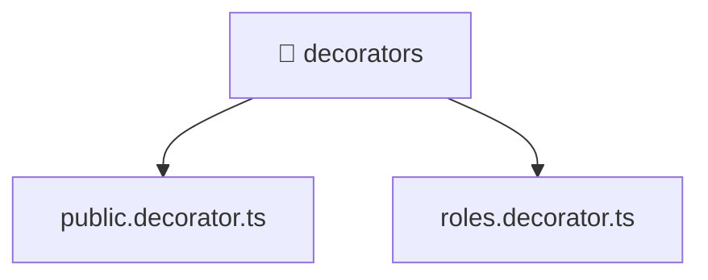

[🏠 Home](../../../../README.md) > [backend](../../../README.md) > [src](../../README.md) > [common](../README.md) > [decorators](./README.md)

# 📁 decorators

### 🎯 PURPOSE
Welcome to the exquisite **decorators** module of the Mavluda Beauty ecosystem. This directory handles specific domain assets and logic. It is designed adhering to our 'Luxury Professional' standards.

### 🏗️ ARCHITECTURE


### 📄 FILE REGISTRY
| File Name | Type | Responsibility | Key Aliases Used |
|---|---|---|---|
| `public.decorator.ts` | TypeScript File | Provides logic and definitions for public.decorator.ts. | @nestjs |
| `roles.decorator.ts` | TypeScript File | Provides logic and definitions for roles.decorator.ts. | @nestjs |

### 🔗 DEPENDENCIES
- `@nestjs/common`

### 🛠️ USAGE
```typescript
// Example interaction or integration snippet
// Import members from decorators based on module boundaries
```
