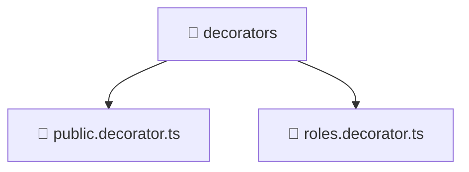

# 📁 Mavluda Beauty decorators

[backend](/backend) / [src](/backend/src) / [common](/backend/src/common) / [decorators](/backend/src/common/decorators)

## 🎯 Purpose
Delivering luxury-tier architectural components and high-performance logic for the **decorators** domain. This directory is a crucial part of the Mavluda Beauty full-stack ecosystem, ensuring seamless scalability, robust performance, and an elite digital experience.

## 🏗️ Architecture


## 📄 File Registry
| File Name | Type | Responsibility | Key Aliases Used |
|---|---|---|---|
| `public.decorator.ts` | TypeScript Logic | Core logic and utilities for this domain. | `@nestjs/common` |
| `roles.decorator.ts` | TypeScript Logic | Core logic and utilities for this domain. | `@nestjs/common` |


## 🔗 Dependencies
**Path Aliases:**
- `@nestjs/common`


## 🛠️ Usage
```typescript
// Example integration for decorators
// Import capabilities from this directory to enrich your modules.
```
> This directory provides specialized logic tailored to the Mavluda Beauty standard.
