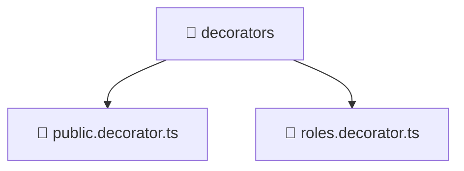

# 📁 decorators

[Root](/.) > [backend](/backend) > [src](/backend/src) > [common](/backend/src/common) > [decorators](/backend/src/common/decorators)

## 🎯 Purpose
Shared utility functions, helpers, and common logic applicable across multiple modules.

## 🏗️ Architecture


## 📄 File Registry
| File Name | Type | Responsibility | Key Aliases Used |
|---|---|---|---|
| `public.decorator.ts` | TypeScript | Provides core logic and orchestration for public.decorator.ts. | @nestjs |
| `roles.decorator.ts` | TypeScript | Provides core logic and orchestration for roles.decorator.ts. | @nestjs |

## 🔗 Dependencies
- `@nestjs/common`

## 🛠️ Usage
```typescript
import { specificUtility } from './utils';
const result = specificUtility(input);
```
