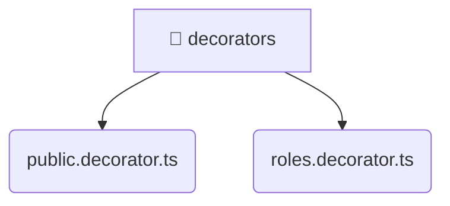

# [root](/) / [backend](/backend) / [src](/backend/src) / [common](/backend/src/common) / [decorators](/backend/src/common/decorators)

## 🏷️ 📁 Decorators

### 🎯 PURPOSE
The `decorators` directory provides core backend services and configuration.

### 🏗️ ARCHITECTURE


### 📄 FILE REGISTRY
| File Name | Type | Responsibility | Key Aliases Used |
|---|---|---|---|
| `public.decorator.ts` | `ts` | Core logic implementation. | @nestjs |
| `roles.decorator.ts` | `ts` | Core logic implementation. | @nestjs |

### 🔗 DEPENDENCIES
- `@nestjs/common`

### 🛠️ USAGE
```typescript
// Seamlessly integrate decorators into your refined workflows:
import { /* exported members */ } from '@path/to/decorators';
```
