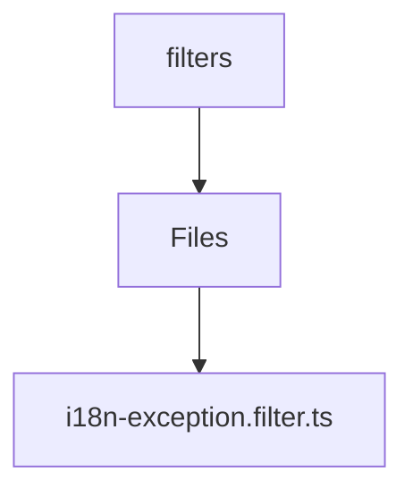

# 🏷️ Filters Directory

> *Elegance, Precision, and Luxury Professionalism — The Mavluda Beauty Standard.*

## 🧭 Breadcrumb Navigation
[backend](/backend) ➔ [src](/backend/src) ➔ [common](/backend/src/common) ➔ [filters](/backend/src/common/filters)

## 🎯 Purpose
This directory encapsulates the essential architecture and logic for the **Filters** domain within the Mavluda Beauty ecosystem. It serves as a foundational component ensuring robust, scalable, and elegant operations.

## 🏗️ Architecture


## 📄 File Registry
| File Name | Type | Responsibility | Key Aliases Used |
|---|---|---|---|
| `i18n-exception.filter.ts` | TypeScript | Exports: I18nExceptionFilter | None |

## 🔗 Dependencies
- `@nestjs/common`
- `express`

## 🛠️ Usage
```typescript
// To utilize the luxurious capabilities of this module:
import { I18nExceptionFilter } from './path/to/i18nexceptionfilter';

// Ensure properly typed interactions per Mavluda Beauty standards
```
