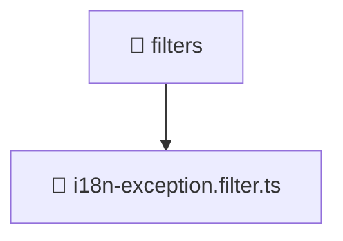

# 📁 filters

[Root](/.) > [backend](/backend) > [src](/backend/src) > [common](/backend/src/common) > [filters](/backend/src/common/filters)

## 🎯 Purpose
Delivering luxury-tier architectural components and high-performance logic for the **filters** domain. This directory is a crucial part of the Mavluda Beauty full-stack ecosystem, ensuring seamless scalability, robust performance, and an elite digital experience.

## 🏗️ Architecture


## 📄 File Registry
| File Name | Type | Responsibility | Key Aliases Used |
|---|---|---|---|
| `i18n-exception.filter.ts` | TypeScript | Provides core logic and orchestration for i18n-exception.filter.ts. | N/A |

## 🔗 Dependencies
- `../constants/error-messages.constant`
- `express`

## 🛠️ Usage
```typescript
// Example usage within the Mavluda Beauty ecosystem
import { relevantMember } from './filters';

// Integrate into the application architecture
relevantMember.execute();
```
