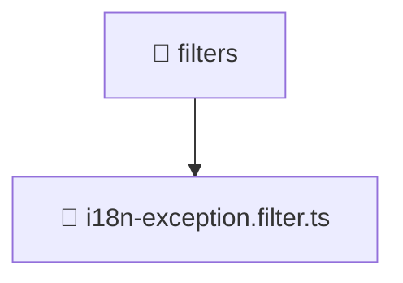

### 🧭 Breadcrumbs
[Root](/) > [backend](/backend) > [src](/backend/src) > [common](/backend/src/common) > [filters](/backend/src/common/filters)

# 📁 Filters Directory
**Architecture Layer:** Domain/Infrastructure Layer

## 🎯 Purpose
Provides luxury professional architectural implementation for the filters module within the Mavluda Beauty ecosystem. Ensure robust functionality and elegant integration with the broader architecture.

## 🏗️ ARCHITECTURE


## 📄 FILE REGISTRY
| File Name | Type | Responsibility | Key Aliases Used |
|---|---|---|---|
| `i18n-exception.filter.ts` | TypeScript | Provides core logic and orchestration for i18n-exception.filter.ts. | @nestjs/common |

## 🔗 DEPENDENCIES
- `@nestjs/common`

## 🛠️ USAGE
```typescript
// Example architectural integration for filters
// Utilize the exported members according to Mavluda Beauty's standard conventions.
```

---
*Maintained by Mavluda Beauty - Architecture & Engineering*

---
*Maintained by Mavluda Beauty - Architecture & Engineering*