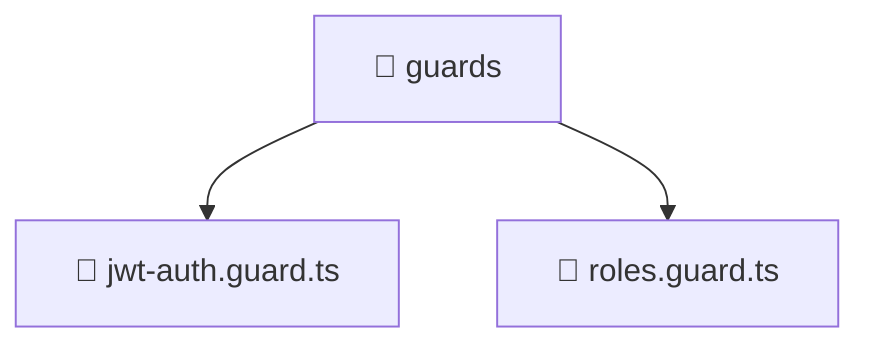

### 🧭 Breadcrumbs
[Root](/) > [backend](/backend) > [src](/backend/src) > [common](/backend/src/common) > [guards](/backend/src/common/guards)

# 📁 Guards Directory
**Architecture Layer:** Domain/Infrastructure Layer

## 🎯 Purpose
Provides luxury professional architectural implementation for the guards module within the Mavluda Beauty ecosystem. Ensure robust functionality and elegant integration with the broader architecture.

## 🏗️ ARCHITECTURE


## 📄 FILE REGISTRY
| File Name | Type | Responsibility | Key Aliases Used |
|---|---|---|---|
| `jwt-auth.guard.ts` | TypeScript | Provides core logic and orchestration for jwt-auth.guard.ts. | @nestjs/common, @nestjs/passport, @nestjs/core |
| `roles.guard.ts` | TypeScript | Provides core logic and orchestration for roles.guard.ts. | @nestjs/common, @nestjs/core |

## 🔗 DEPENDENCIES
- `@nestjs/common`
- `@nestjs/core`
- `@nestjs/passport`

## 🛠️ USAGE
```typescript
// Example architectural integration for guards
// Utilize the exported members according to Mavluda Beauty's standard conventions.
```

---
*Maintained by Mavluda Beauty - Architecture & Engineering*

---
*Maintained by Mavluda Beauty - Architecture & Engineering*