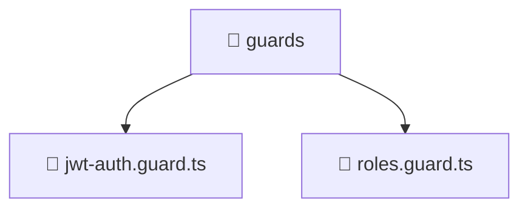

# 📁 guards

[Root](/.) > [backend](/backend) > [src](/backend/src) > [common](/backend/src/common) > [guards](/backend/src/common/guards)

## 🎯 Purpose
Delivering luxury-tier architectural components and high-performance logic for the **guards** domain. This directory is a crucial part of the Mavluda Beauty full-stack ecosystem, ensuring seamless scalability, robust performance, and an elite digital experience.

## 🏗️ Architecture


## 📄 File Registry
| File Name | Type | Responsibility | Key Aliases Used |
|---|---|---|---|
| `jwt-auth.guard.ts` | File | Core logic and utilities for this domain. | @nestjs |
| `roles.guard.ts` | File | Core logic and utilities for this domain. | @nestjs |


## 🔗 Dependencies
- `@nestjs/common`
- `@nestjs/core`
- `@nestjs/passport`
- `../decorators/public.decorator`
- `../decorators/roles.decorator`

## 🛠️ Usage
```typescript
// Example usage within the Mavluda Beauty ecosystem
import { relevantMember } from './jwt-auth.guard';

// Integrate into the application architecture
relevantMember.execute();
```
