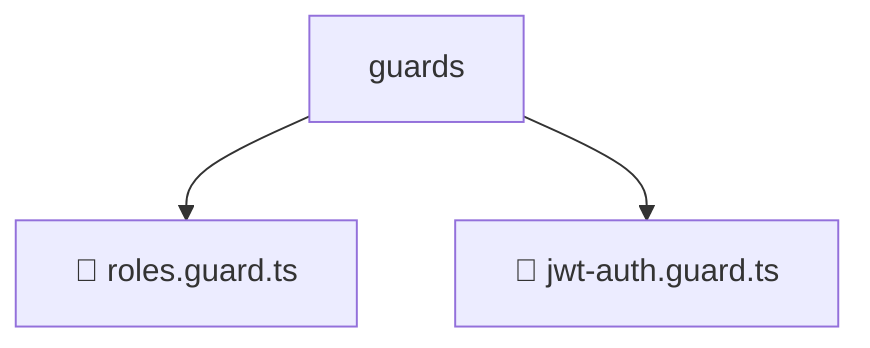

# 📂 GUARDS

> 💎 **Mavluda Beauty - Luxury Professional Architecture**

### 📍 Breadcrumb Navigation
`. > backend > src > common > guards`

## 🎯 PURPOSE
This directory encapsulates `Backend Core/Infrastructure` level functionality within the Mavluda Beauty ecosystem, ensuring proper separation of concerns and architectural transparency.

**FSD / Architecture Layer:** `Backend Core/Infrastructure`

## 🏗️ ARCHITECTURE


## 📄 FILE REGISTRY

| Item Name | Type | Responsibility | Key Aliases Used |
|-----------|------|----------------|------------------|
| `📄 roles.guard.ts` | `.ts` | General functionality | `@nestjs/common, @nestjs/core` |
| `📄 jwt-auth.guard.ts` | `.ts` | General functionality | `@nestjs/common, @nestjs/passport, @nestjs/core` |

## 🔗 DEPENDENCIES
- `@nestjs/common`
- `@nestjs/passport`
- `@nestjs/core`

## 🛠️ USAGE
```typescript
// Example usage context
import { ... } from './roles.guard';

// Integrate roles.guard logic into your feature.
```
