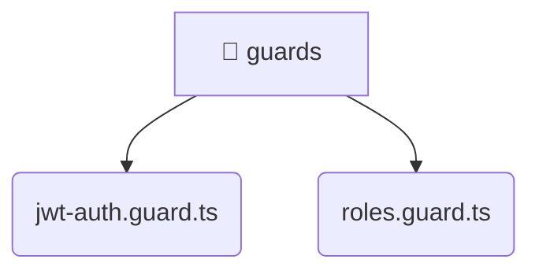

# [root](/) / [backend](/backend) / [src](/backend/src) / [common](/backend/src/common) / [guards](/backend/src/common/guards)

## 🏷️ 📁 Guards

### 🎯 PURPOSE
The `guards` directory provides core backend services and configuration.

### 🏗️ ARCHITECTURE


### 📄 FILE REGISTRY
| File Name | Type | Responsibility | Key Aliases Used |
|---|---|---|---|
| `jwt-auth.guard.ts` | `ts` | Core logic implementation. | @nestjs |
| `roles.guard.ts` | `ts` | Core logic implementation. | @nestjs |

### 🔗 DEPENDENCIES
- `../decorators/public.decorator`
- `../decorators/roles.decorator`
- `@nestjs/common`
- `@nestjs/core`
- `@nestjs/passport`

### 🛠️ USAGE
```typescript
// Seamlessly integrate guards into your refined workflows:
import { /* exported members */ } from '@path/to/guards';
```
