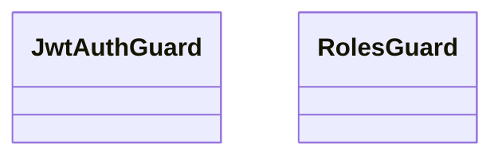

# 📁 Guards Directory

[Root](/.) / [backend](/backend) / [src](/backend/src) / [common](/backend/src/common) / [guards](/backend/src/common/guards)

## 🎯 Purpose
Delivering luxury-tier architectural components and high-performance logic for the **guards** domain. This directory is a crucial part of the Mavluda Beauty full-stack ecosystem, ensuring seamless scalability, robust performance, and an elite digital experience.

## 🏗️ Architecture


## 📄 File Registry
| File Name | Type | Responsibility | Key Aliases Used |
|---|---|---|---|
| `jwt-auth.guard.ts` | File | Provides core logic and orchestration for jwt-auth.guard.ts. | @nestjs/core, @nestjs/passport, @nestjs/common |
| `roles.guard.ts` | File | Provides core logic and orchestration for roles.guard.ts. | @nestjs/core, @nestjs/common |

## 🔗 Dependencies
- Relies on internal Mavluda Beauty architecture and designated FSD layers.
- See 'Key Aliases Used' in the File Registry for explicit cross-domain references.

## 🛠️ Usage
```typescript
// Example usage within the Mavluda Beauty ecosystem
import { relevantMember } from './core';

// Integrate into the application architecture
relevantMember.execute();
```
