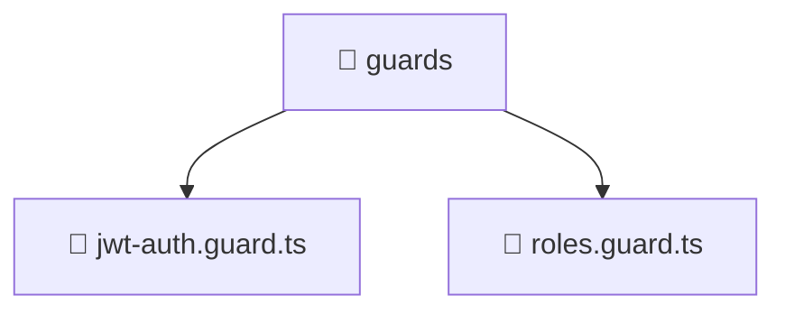

# 📁 guards

[Root](/.) > [backend](/backend) > [src](/backend/src) > [common](/backend/src/common) > [guards](/backend/src/common/guards)

## 🎯 Purpose
Shared utility functions, helpers, and common logic applicable across multiple modules.

## 🏗️ Architecture


## 📄 File Registry
| File Name | Type | Responsibility | Key Aliases Used |
|---|---|---|---|
| `jwt-auth.guard.ts` | TypeScript | Provides core logic and orchestration for jwt-auth.guard.ts. | @nestjs |
| `roles.guard.ts` | TypeScript | Provides core logic and orchestration for roles.guard.ts. | @nestjs |

## 🔗 Dependencies
- `../decorators/public.decorator`
- `../decorators/roles.decorator`
- `@nestjs/common`
- `@nestjs/core`
- `@nestjs/passport`

## 🛠️ Usage
```typescript
import { specificUtility } from './utils';
const result = specificUtility(input);
```
