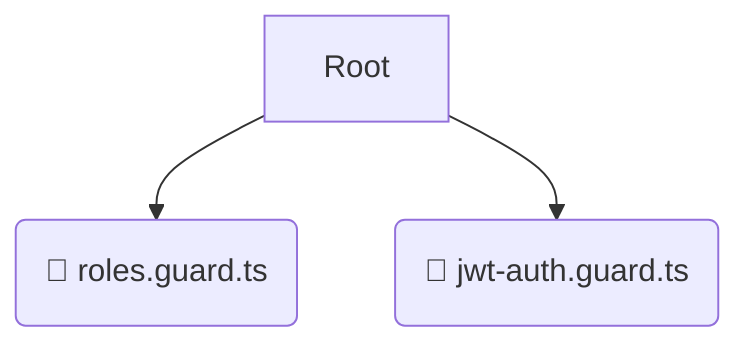

# 🛡️ guards

*Breadcrumbs:* [backend](/backend) / [src](/backend/src) / [common](/backend/src/common) / [guards](/backend/src/common/guards)

## 🎯 PURPOSE
This directory `guards` is an integral part of the Mavluda Beauty ecosystem. It supports the scalable NestJS backend architecture.
This directory is meticulously maintained to uphold the 'Luxury Professional' standards of the Mavluda Beauty brand.

## 🏗️ ARCHITECTURE


## 📄 FILE REGISTRY
| File Name | Type | Responsibility | Key Aliases Used |
|---|---|---|---|
| `roles.guard.ts` | `ts` | Core functionality | `@nestjs/common, @nestjs/core` |
| `jwt-auth.guard.ts` | `ts` | Core functionality | `@nestjs/common, @nestjs/core, @nestjs/passport` |

## 🔗 DEPENDENCIES
- `@nestjs/common`
- `@nestjs/core`
- `@nestjs/passport`

## 🛠️ USAGE
```typescript
// Example placeholder for interacting with the guards module
import { example } from './roles.guard.ts';
```
