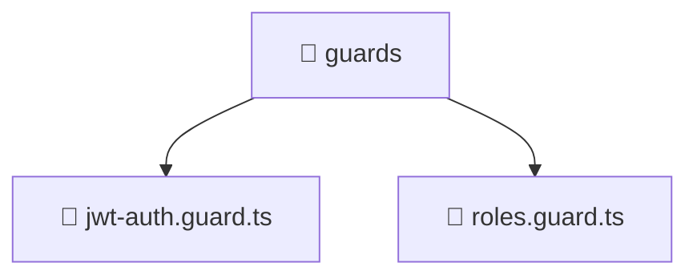

<!--
Mavluda Beauty - Luxury Professional Documentation
Generated for 100% Architectural Transparency
-->
[Home](../../../../README.md) > [backend](../../../README.md) > [src](../../README.md) > [common](../README.md) > [guards](./README.md)

# 📁 GUARDS Directory

## 🎯 PURPOSE
Manages the guards module, providing robust and secure backend services for the Mavluda Beauty application.

## 🏗️ ARCHITECTURE


## 📄 FILE REGISTRY
| File Name | Type | Responsibility | Key Aliases Used |
|---|---|---|---|
| `jwt-auth.guard.ts` | TypeScript | Route protection and authorization logic. | @nestjs |
| `roles.guard.ts` | TypeScript | Route protection and authorization logic. | @nestjs |


## 🔗 DEPENDENCIES
- `@nestjs/common`
- `@nestjs/core`
- `@nestjs/passport`
- `../decorators/public.decorator`
- `../decorators/roles.decorator`

## 🛠️ USAGE
```typescript
// Example placeholder for interacting with guards
// Consult the individual files in the registry for specific APIs.
```
