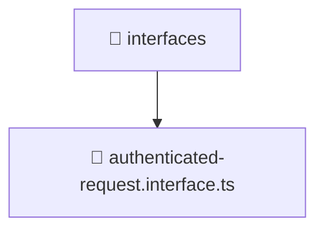

<!--
Mavluda Beauty - Luxury Professional Documentation
Generated for 100% Architectural Transparency
-->
[Home](../../../../README.md) > [backend](../../../README.md) > [src](../../README.md) > [common](../README.md) > [interfaces](./README.md)

# 📁 INTERFACES Directory

## 🎯 PURPOSE
Manages the interfaces module, providing robust and secure backend services for the Mavluda Beauty application.

## 🏗️ ARCHITECTURE


## 📄 FILE REGISTRY
| File Name | Type | Responsibility | Key Aliases Used |
|---|---|---|---|
| `authenticated-request.interface.ts` | TypeScript | Core logic implementation. | - |


## 🔗 DEPENDENCIES
- `express`

## 🛠️ USAGE
```typescript
// Example placeholder for interacting with interfaces
// Consult the individual files in the registry for specific APIs.
```
