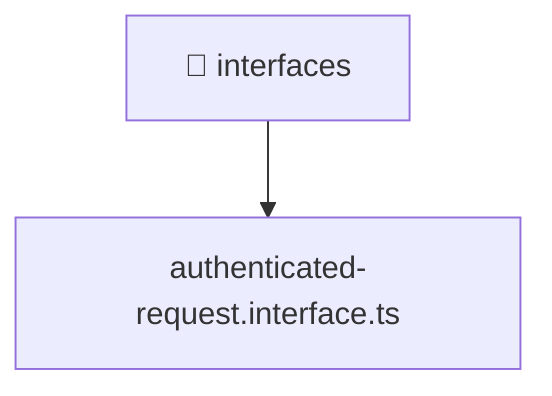

[🏠 Home](../../../../README.md) > [backend](../../../README.md) > [src](../../README.md) > [common](../README.md) > [interfaces](./README.md)

# 📁 interfaces

### 🎯 PURPOSE
Welcome to the exquisite **interfaces** module of the Mavluda Beauty ecosystem. This directory handles specific domain assets and logic. It is designed adhering to our 'Luxury Professional' standards.

### 🏗️ ARCHITECTURE


### 📄 FILE REGISTRY
| File Name | Type | Responsibility | Key Aliases Used |
|---|---|---|---|
| `authenticated-request.interface.ts` | TypeScript File | Defines interfaces/types: AuthenticatedRequest. | None |

### 🔗 DEPENDENCIES
- `express`

### 🛠️ USAGE
```typescript
// Example interaction or integration snippet
// Import members from interfaces based on module boundaries
```
