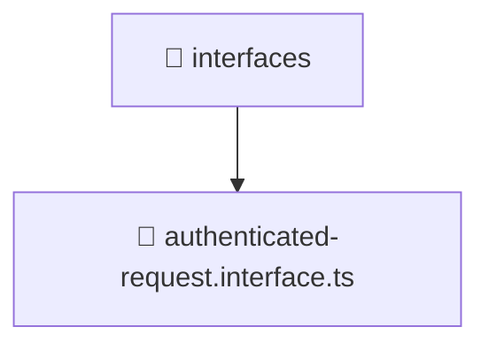

# 📁 interfaces

[Root](/.) > [backend](/backend) > [src](/backend/src) > [common](/backend/src/common) > [interfaces](/backend/src/common/interfaces)

## 🎯 Purpose
Data models, type definitions, schemas, and Data Transfer Objects (DTOs) for structural typing.

## 🏗️ Architecture


## 📄 File Registry
| File Name | Type | Responsibility | Key Aliases Used |
|---|---|---|---|
| `authenticated-request.interface.ts` | TypeScript | Provides core logic and orchestration for authenticated-request.interface.ts. | N/A |

## 🔗 Dependencies
- `express`

## 🛠️ Usage
```typescript
import { SpecificModel } from './models';
let data: SpecificModel;
```
