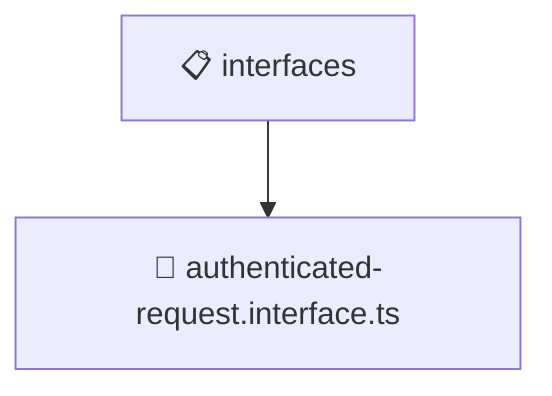

# 📋 interfaces

[Root](/.) > [backend](/backend) > [src](/backend/src) > [common](/backend/src/common) > [interfaces](/backend/src/common/interfaces)

## 🎯 Purpose
Delivering luxury-tier architectural components and high-performance logic for the **interfaces** domain. This directory is a crucial part of the Mavluda Beauty full-stack ecosystem, ensuring seamless scalability, robust performance, and an elite digital experience.

## 🏗️ Architecture


## 📄 File Registry
| File Name | Type | Responsibility | Key Aliases Used |
|---|---|---|---|
| `authenticated-request.interface.ts` | File | Core logic and utilities for this domain. | N/A |


## 🔗 Dependencies
- `express`

## 🛠️ Usage
```typescript
// Example usage within the Mavluda Beauty ecosystem
import { relevantMember } from './authenticated-request.interface';

// Integrate into the application architecture
relevantMember.execute();
```
