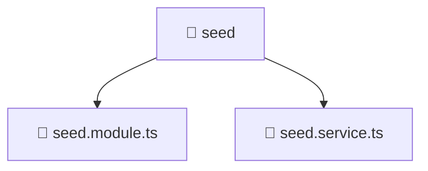

### 🧭 Breadcrumbs
[Root](/) > [backend](/backend) > [src](/backend/src) > [common](/backend/src/common) > [seed](/backend/src/common/seed)

# 📁 Seed Directory
**Architecture Layer:** Domain/Infrastructure Layer

## 🎯 Purpose
Provides luxury professional architectural implementation for the seed module within the Mavluda Beauty ecosystem. Ensure robust functionality and elegant integration with the broader architecture.

## 🏗️ ARCHITECTURE


## 📄 FILE REGISTRY
| File Name | Type | Responsibility | Key Aliases Used |
|---|---|---|---|
| `seed.module.ts` | TypeScript | Contains core business logic. | @nestjs/common, @common/config/app-config.module, @modules/user |
| `seed.service.ts` | TypeScript | Contains core business logic. | @nestjs/common, @modules/user/domain/user.entity, @common/config/app-config.service, @modules/user |

## 🔗 DEPENDENCIES
- `@common/config/app-config.module`
- `@common/config/app-config.service`
- `@modules/user`
- `@modules/user/domain/user.entity`
- `@nestjs/common`

## 🛠️ USAGE
```typescript
// Example architectural integration for seed
// Utilize the exported members according to Mavluda Beauty's standard conventions.
```

---
*Maintained by Mavluda Beauty - Architecture & Engineering*

---
*Maintained by Mavluda Beauty - Architecture & Engineering*