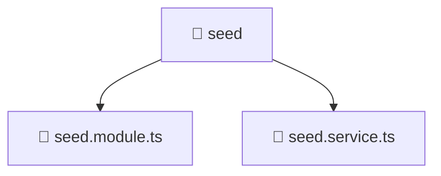

# 📁 seed

[Root](/.) > [backend](/backend) > [src](/backend/src) > [common](/backend/src/common) > [seed](/backend/src/common/seed)

## 🎯 Purpose
Delivering luxury-tier architectural components and high-performance logic for the **seed** domain. This directory is a crucial part of the Mavluda Beauty full-stack ecosystem, ensuring seamless scalability, robust performance, and an elite digital experience.

## 🏗️ Architecture


## 📄 File Registry
| File Name | Type | Responsibility | Key Aliases Used |
|---|---|---|---|
| `seed.module.ts` | TypeScript | Module configuration and dependency injection for seed.module.ts. | @common, @modules, @nestjs |
| `seed.service.ts` | TypeScript | Service layer business logic and data access for seed.service.ts. | @common, @modules, @nestjs |

## 🔗 Dependencies
- `./seed.service`
- `@common/config/app-config.module`
- `@common/config/app-config.service`
- `@modules/user`
- `@modules/user/domain/user.entity`
- `@nestjs/common`
- `bcrypt`

## 🛠️ Usage
```typescript
// Example usage within the Mavluda Beauty ecosystem
import { relevantMember } from './seed';

// Integrate into the application architecture
relevantMember.execute();
```
