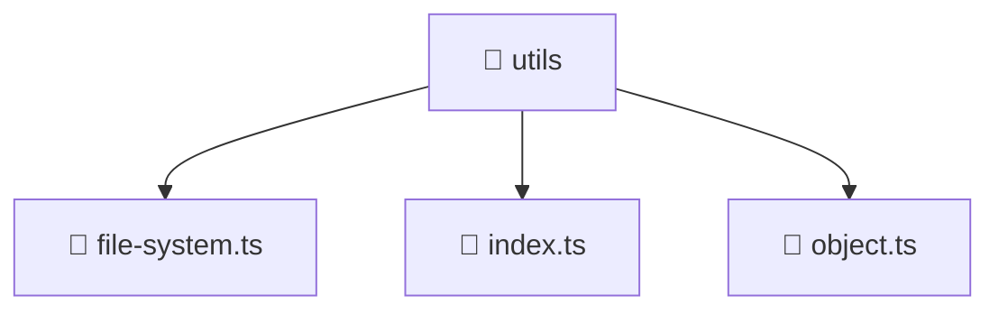

# 🧰 utils

[Root](/.) > [backend](/backend) > [src](/backend/src) > [common](/backend/src/common) > [utils](/backend/src/common/utils)

## 🎯 Purpose
Delivering luxury-tier architectural components and high-performance logic for the **utils** domain. This directory is a crucial part of the Mavluda Beauty full-stack ecosystem, ensuring seamless scalability, robust performance, and an elite digital experience.

## 🏗️ Architecture


## 📄 File Registry
| File Name | Type | Responsibility | Key Aliases Used |
|---|---|---|---|
| `file-system.ts` | File | Core logic and utilities for this domain. | N/A |
| `index.ts` | File | Core logic and utilities for this domain. | N/A |
| `object.ts` | File | Core logic and utilities for this domain. | N/A |


## 🔗 Dependencies
- `fs`
- `path`
- `util`
- `./object`
- `./file-system`

## 🛠️ Usage
```typescript
// Example usage within the Mavluda Beauty ecosystem
import { relevantMember } from './file-system';

// Integrate into the application architecture
relevantMember.execute();
```
