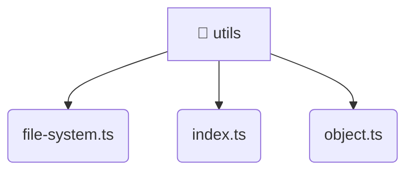

# [backend](/backend) / [src](/backend/src) / [common](/backend/src/common) / [utils](/backend/src/common/utils)

## 🏷️ 🧰 Utils

### 🎯 PURPOSE
The `utils` directory forms a critical foundation within the Mavluda Beauty ecosystem, meticulously orchestrating the utils logic to ensure a seamless and premium experience. Rooted in the NestJS backend architecture, it delivers robust, high-performance operations tailored for high-end beauty and wedding services.

### 🏗️ ARCHITECTURE


### 📄 FILE REGISTRY
| File Name | Type | Responsibility | Key Aliases Used |
|---|---|---|---|
| `file-system.ts` | `ts` | Encapsulates premium logic and definitions for `file-system.ts`. | None |
| `index.ts` | `ts` | Encapsulates premium logic and definitions for `index.ts`. | None |
| `object.ts` | `ts` | Encapsulates premium logic and definitions for `object.ts`. | None |


### 🔗 DEPENDENCIES
- *Self-contained premium module.*

### 🛠️ USAGE
```typescript
// Seamlessly integrate utils into your refined workflows:
import { /* exported members */ } from '@path/to/utils';
```
