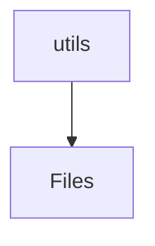
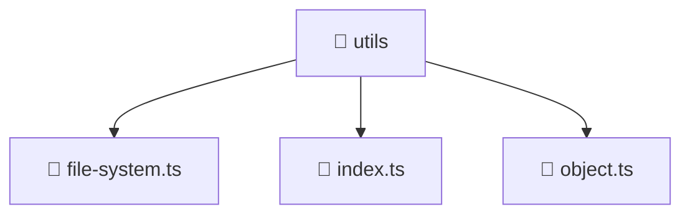

# 🧰 Utils Directory

[backend](/backend) > [src](/backend/src) > [common](/backend/src/common) > [utils](/backend/src/common/utils)

## 🎯 Purpose
A high-level module handling `utils` logic within the Mavluda Beauty ecosystem. This directory adheres to our "Luxury Professional" architectural standards.


## 🏗️ Architecture



## 📄 File Registry
| File Name | Type | Responsibility | Key Aliases Used |
|-----------|------|----------------|------------------|
| `file-system.ts` | TypeScript | Provides localized typescript definitions. | None |
| `index.ts` | TypeScript | Provides localized typescript definitions. | None |
| `object.ts` | TypeScript | Provides localized typescript definitions. | None |

## 🔗 Dependencies
- No major internal/external path aliases detected.

## 🛠️ Usage
```typescript
// Architectural overview snippet
import { InternalLogic } from './internal-file';
// Ensure adherence to Hexagonal / FSD principles
```

## 📝 Existing Context
# 📁 utils

[Root](/.) > [backend](/backend) > [src](/backend/src) > [common](/backend/src/common) > [utils](/backend/src/common/utils)

## 🎯 Purpose
Delivering luxury-tier architectural components and high-performance logic for the **utils** domain. This directory is a crucial part of the Mavluda Beauty full-stack ecosystem, ensuring seamless scalability, robust performance, and an elite digital experience.

## 🏗️ Architecture


## 📄 File Registry
| File Name | Type | Responsibility | Key Aliases Used |
|---|---|---|---|
| `file-system.ts` | TypeScript | Provides core logic and orchestration for file-system.ts. | N/A |
| `index.ts` | TypeScript | Provides core logic and orchestration for index.ts. | N/A |
| `object.ts` | TypeScript | Provides core logic and orchestration for object.ts. | N/A |

## 🔗 Dependencies
- `fs`
- `path`
- `util`

## 🛠️ Usage
```typescript
// Example usage within the Mavluda Beauty ecosystem
import { relevantMember } from './utils';

// Integrate into the application architecture
relevantMember.execute();
```
