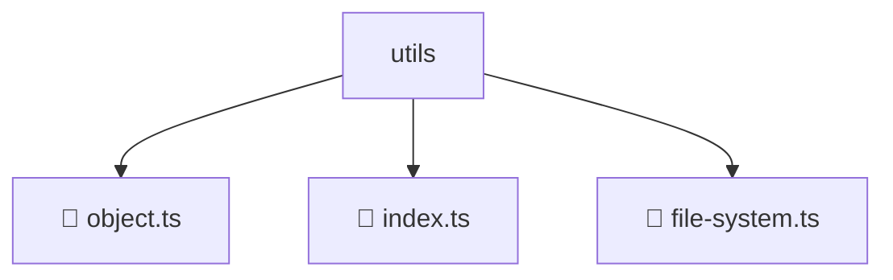

# 📂 UTILS

> 💎 **Mavluda Beauty - Luxury Professional Architecture**

### 📍 Breadcrumb Navigation
`. > backend > src > common > utils`

## 🎯 PURPOSE
This directory encapsulates `Backend Core/Infrastructure` level functionality within the Mavluda Beauty ecosystem, ensuring proper separation of concerns and architectural transparency.

**FSD / Architecture Layer:** `Backend Core/Infrastructure`

## 🏗️ ARCHITECTURE


## 📄 FILE REGISTRY

| Item Name | Type | Responsibility | Key Aliases Used |
|-----------|------|----------------|------------------|
| `📄 object.ts` | `.ts` | General functionality | `None` |
| `📄 index.ts` | `.ts` | General functionality | `None` |
| `📄 file-system.ts` | `.ts` | General functionality | `None` |

## 🔗 DEPENDENCIES
No external/internal aliases used directly in these files.

## 🛠️ USAGE
```typescript
// Example usage context
import { ... } from './object';

// Integrate object logic into your feature.
```
