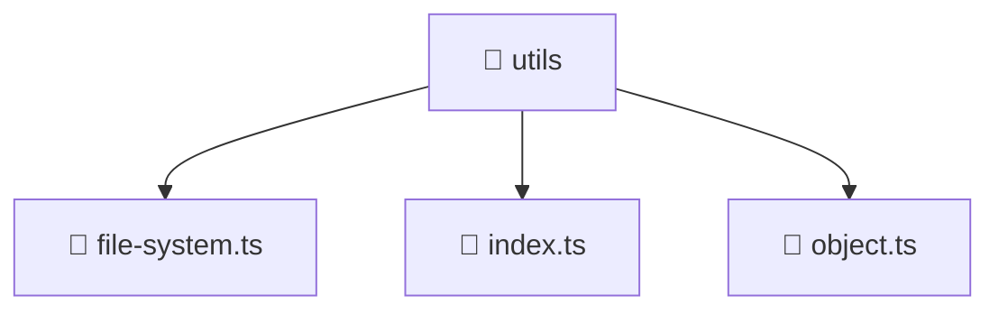

<!--
Mavluda Beauty - Luxury Professional Documentation
Generated for 100% Architectural Transparency
-->
[Home](../../../../README.md) > [backend](../../../README.md) > [src](../../README.md) > [common](../README.md) > [utils](./README.md)

# 📁 UTILS Directory

## 🎯 PURPOSE
Manages the utils module, providing robust and secure backend services for the Mavluda Beauty application.

## 🏗️ ARCHITECTURE


## 📄 FILE REGISTRY
| File Name | Type | Responsibility | Key Aliases Used |
|---|---|---|---|
| `file-system.ts` | TypeScript | Core logic implementation. | - |
| `index.ts` | TypeScript | Core logic implementation. | - |
| `object.ts` | TypeScript | Core logic implementation. | - |


## 🔗 DEPENDENCIES
- `fs`
- `path`
- `util`

## 🛠️ USAGE
```typescript
// Example placeholder for interacting with utils
// Consult the individual files in the registry for specific APIs.
```
