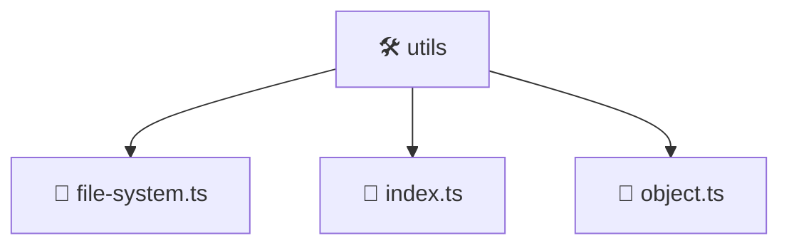

# 🛠️ Mavluda Beauty utils

[backend](/backend) / [src](/backend/src) / [common](/backend/src/common) / [utils](/backend/src/common/utils)

## 🎯 Purpose
Delivering luxury-tier architectural components and high-performance logic for the **utils** domain. This directory is a crucial part of the Mavluda Beauty full-stack ecosystem, ensuring seamless scalability, robust performance, and an elite digital experience.

## 🏗️ Architecture


## 📄 File Registry
| File Name | Type | Responsibility | Key Aliases Used |
|---|---|---|---|
| `file-system.ts` | TypeScript Logic | Core logic and utilities for this domain. | N/A |
| `index.ts` | TypeScript Logic | Core logic and utilities for this domain. | N/A |
| `object.ts` | TypeScript Logic | Core logic and utilities for this domain. | N/A |


## 🔗 Dependencies
**External Packages:**
- `fs`
- `path`
- `util`


## 🛠️ Usage
```typescript
// Example integration for utils
// Import capabilities from this directory to enrich your modules.
```
> This directory provides specialized logic tailored to the Mavluda Beauty standard.
