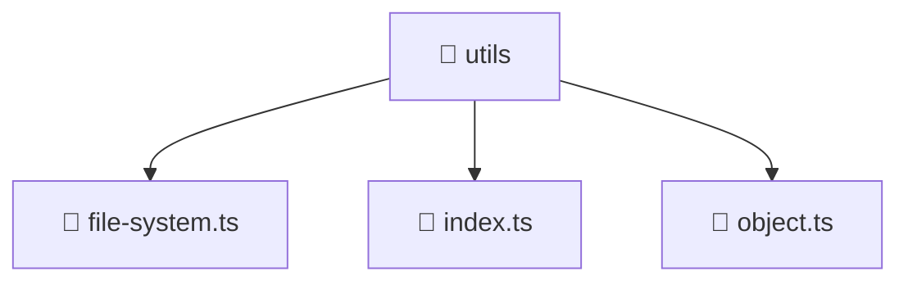

# 📁 utils

[Root](/.) > [backend](/backend) > [src](/backend/src) > [common](/backend/src/common) > [utils](/backend/src/common/utils)

## 🎯 Purpose
Shared utility functions, helpers, and common logic applicable across multiple modules.

## 🏗️ Architecture


## 📄 File Registry
| File Name | Type | Responsibility | Key Aliases Used |
|---|---|---|---|
| `file-system.ts` | TypeScript | Provides core logic and orchestration for file-system.ts. | N/A |
| `index.ts` | TypeScript | Provides core logic and orchestration for index.ts. | N/A |
| `object.ts` | TypeScript | Provides core logic and orchestration for object.ts. | N/A |

## 🔗 Dependencies
- `fs`
- `path`
- `util`

## 🛠️ Usage
```typescript
import { specificUtility } from './utils';
const result = specificUtility(input);
```
