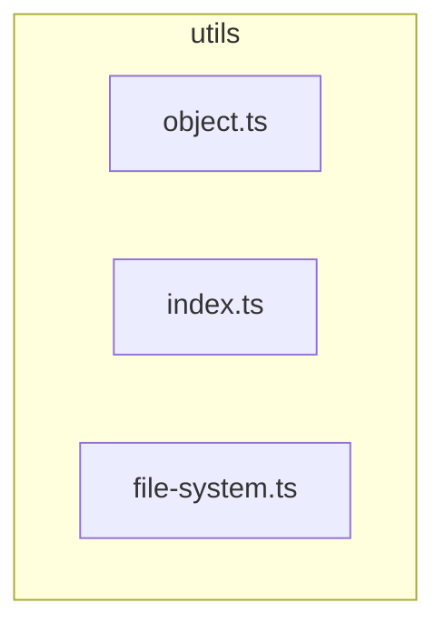

# 📁 utils

[backend](../../../README.md) > [src](../../README.md) > [common](../README.md) > [utils](README.md)

---

### 🎯 PURPOSE
Elevating the digital experience for the Mavluda Beauty ecosystem, this module manages the sophisticated Common Layer (Cross-cutting concerns) operations.

*FSD Layer:* **Common Layer (Cross-cutting concerns)**

---

### 🏗️ ARCHITECTURE



---

### 📄 FILE REGISTRY
| File Name | Type | Responsibility | Key Aliases Used |
|-----------|------|----------------|------------------|
| `object.ts` | Source | Handles source logic for Mavluda Beauty's luxury standards. | `None` |
| `index.ts` | Source | Handles source logic for Mavluda Beauty's luxury standards. | `None` |
| `file-system.ts` | Source | Handles source logic for Mavluda Beauty's luxury standards. | `None` |

---

### 🔗 DEPENDENCIES
Notable imports:
- `fs`
- `util`
- `path`
- `./object`
- `./file-system`

---

### 🛠️ USAGE
To interact with this directory's luxurious logic, integrate its exported components or services directly into your feature modules. Ensure strict adherence to the Common Layer (Cross-cutting concerns) boundaries.

```typescript
// Example integration snippet
import { FeatureModule } from '@path/to/utils';
```
