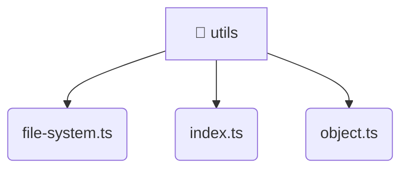

# [root](/) / [backend](/backend) / [src](/backend/src) / [common](/backend/src/common) / [utils](/backend/src/common/utils)

## 🏷️ 📁 Utils

### 🎯 PURPOSE
The `utils` directory provides core backend services and configuration.

### 🏗️ ARCHITECTURE


### 📄 FILE REGISTRY
| File Name | Type | Responsibility | Key Aliases Used |
|---|---|---|---|
| `file-system.ts` | `ts` | Core logic implementation. | None |
| `index.ts` | `ts` | Core logic implementation. | None |
| `object.ts` | `ts` | Core logic implementation. | None |

### 🔗 DEPENDENCIES
- `./file-system`
- `./object`
- `fs`
- `path`
- `util`

### 🛠️ USAGE
```typescript
// Seamlessly integrate utils into your refined workflows:
import { /* exported members */ } from '@path/to/utils';
```
